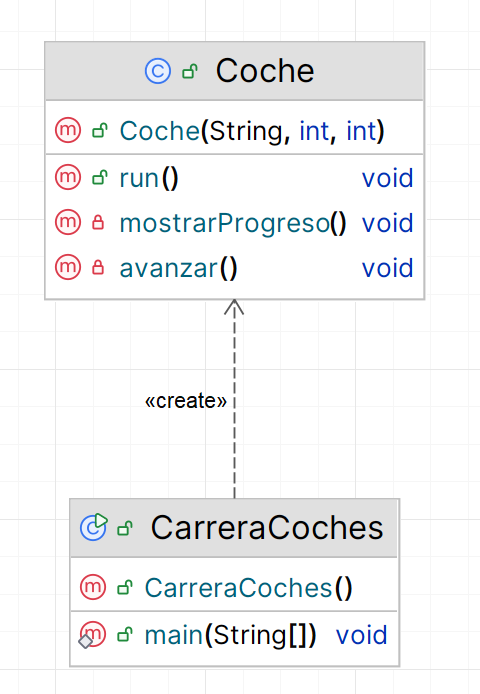

# 3. Carrera de coches
Realiza una aplicación que simule una carrera de coches (de hasta 4 coches). Para cada coche se podrá configurar su velocidad y en la aplicación podremos configurar la distancia del circuito. Al final de la carrera se anunciará el coche ganador y los demás se detendrán mostrando cuánta distancia han recorrido

Este programa implementa una carrera de coches con las siguientes características:

1. Permite configurar:
    - La distancia total del circuito
    - El número de coches (máximo 4)
    - La velocidad de cada coche

2. Cada coche es un hilo independiente que:
    - Avanza según su velocidad
    - Muestra una barra de progreso en tiempo real
    - Se actualiza cada segundo

3. La visualización incluye:
    - Barras de progreso usando caracteres ASCII
    - Porcentaje completado para cada coche
    - Anuncio del ganador

4. Cuando un coche gana:
    - Se anuncia el ganador
    - Los demás coches se detienen
    - Se muestra la distancia recorrida por cada coche
El resultado sería como este:
````plaintext
Introduce la distancia del circuito (metros): 1000
Introduce el número de coches (máximo 4): 3
Introduce la velocidad del coche 1 (metros/segundo): 100
Introduce la velocidad del coche 2 (metros/segundo): 50
Introduce la velocidad del coche 3 (metros/segundo): 75

¡Comienza la carrera!
===================
Coche 1 [==>                 ] 10%
Coche 3 [=>                  ] 7%
Coche 2 [=>                  ] 5%
Coche 2 [==>                 ] 10%
Coche 3 [===>                ] 15%
Coche 1 [====>               ] 20%
Coche 2 [===>                ] 15%
Coche 3 [====>               ] 22%
Coche 1 [======>             ] 30%
Coche 2 [====>               ] 20%
Coche 1 [========>           ] 40%
Coche 3 [======>             ] 30%
Coche 2 [=====>              ] 25%
Coche 1 [==========>         ] 50%
Coche 3 [=======>            ] 37%
Coche 2 [======>             ] 30%
Coche 3 [=========>          ] 45%
Coche 1 [============>       ] 60%
Coche 2 [=======>            ] 35%
Coche 1 [==============>     ] 70%
Coche 3 [==========>         ] 52%
Coche 2 [========>           ] 40%
Coche 3 [============>       ] 60%
Coche 1 [================>   ] 80%
Coche 2 [=========>          ] 45%
Coche 3 [=============>      ] 67%
Coche 1 [==================> ] 90%
Coche 2 [==========>         ] 50%
Coche 1 [====================] 100%
Coche 3 [===============>    ] 75%

¡Coche 1 ha ganado la carrera!
Coche 2 [===========>        ] 55%
Coche 3 [================>   ] 82%

¡Carrera finalizada!

Process finished with exit code 0
````
Y este es el diagrama de clases:
